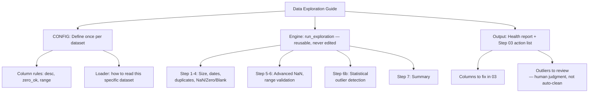

# 01 Data Exploration

## What This Stage Did

Checked data quality on all three raw datasets (Billboard Hot 100, Spotify Hit Predictor, Music Dataset 1950–2019) before doing anything else with them: row/column counts, date ranges, duplicates, missing/zero/blank values, value-range violations, and statistical outliers. The output is a health report and action list for each dataset, which the next stage works off.

## How I Did It

One reusable function, `run_exploration()`, takes a small CONFIG per dataset (column descriptions, whether zero is a valid value, expected ranges, how to load the file) and runs the same set of checks against it. Adding a new dataset just means adding a CONFIG entry. The checking logic itself never changes.

One thing I added that R's original didn't have: an automatic statistical outlier check (IQR method) on top of the manual range rules. I only ever label it `[INFO]`, never `[WARN]`, because it's not reliable enough to trust automatically. It flagged the Billboard "weeks on board" column with a nonsensical negative lower bound, and flagged 23% of a heavily skewed column on the third dataset. Statistically unusual isn't the same as wrong.

## Open Questions / Things I'd Revisit

- IQR outlier detection breaks down on skewed or bounded distributions. It's useful on roughly symmetric columns, not a general-purpose flag. Kept as a manual-review signal, not something that auto-decides anything.
- Not every dataset has a full date column: one only has a decade label, another a bare year. I handle both shapes, but a messier date format down the line might need a new fallback.

---

*Part of [Fu Wei's Data Analysis Pipeline](../README.md)*
