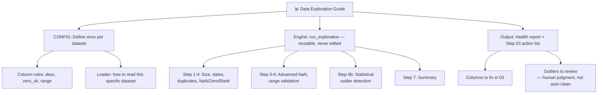

# 📊 01 Data Exploration Guide



## Universal Data Exploration Template

**Applicable to:** Any structured dataset (CSV, Excel, Database)
**Purpose:** Understand data quality and characteristics to prepare for further analysis
**Last Updated:** July 2026

---

## The Core Design Principle: CONFIG / Engine Separation

Earlier versions of this guide walked through writing exploration code by hand for each new dataset. That doesn't scale — every new dataset meant rewriting the same logic with small tweaks.

The current version splits the work into two parts:

- **CONFIG** — the only thing that changes per dataset: column descriptions, whether `0` is a valid value for that column, expected value ranges, and how to load the file. Stored as a plain dict, no logic inside.
- **Engine (`run_exploration()`)** — the actual health-check logic. Takes a CONFIG as input, never needs to be edited when a new dataset comes in.

```python
DATASETS = {
    "d1": {
        "name": "D1 Billboard Hot 100",
        "date_col": "date",
        "chart_size": 100,
        "load": lambda base: pd.read_csv(os.path.join(base, "Data1_charts.csv"), parse_dates=["date"]),
        "col_defs": {
            "rank": {"desc": "Chart rank", "zero_ok": False, "range": (1, 100)},
            # ... one entry per column
        },
        "advanced_nan": {"nan_col": "last-week", "group_col": "weeks-on-board", "debut_val": 1},
    },
    # "d2": {...}, "d3": {...} — same shape, different values
}

cfg = DATASETS["d1"]
df  = cfg["load"](DATA_DIR)
run_exploration(df, cfg["name"], cfg["date_col"], cfg["col_defs"], cfg["advanced_nan"], cfg.get("chart_size"))
```

Adding a new dataset means adding one new entry to `DATASETS`. Nothing inside `run_exploration()` changes.

---

## What `run_exploration()` Checks — 7 Steps + 1

| Step | Checks | Logic source |
|---|---|---|
| 1. Dataset Size | Row/column count, column names | Automatic |
| 2. Date Range | Min/max year, approximate week count (skipped if no date column) | Automatic |
| 3. Duplicate Rows | Exact duplicate row count | Automatic |
| 4. NaN / Zero / Blank | Per-column missing, zero, and whitespace-only counts | Automatic + `zero_ok` from CONFIG |
| 5. Advanced NaN Analysis | Explains *why* a column has NaN (e.g. debut vs re-entry) — only runs if `advanced_nan` is set | CONFIG-driven, optional |
| 6. Value Range Validation | Flags values outside a **manually defined** business rule (e.g. chart rank must be 1-100) | CONFIG (`range`) |
| **6b. IQR Outlier Detection** | Flags values that are statistically unusual **within the dataset's own distribution** | Automatic, no CONFIG needed |
| 7. Summary | Aggregates all warnings into a single action list for the cleaning stage (`03_data_wrangling`) | Automatic |

### Why Step 6 and Step 6b are two separate checks

They answer two different questions:

- **Step 6** asks: *"Does this violate a rule I already know?"* (a chart rank of 150 is impossible — that's a fact about Billboard, not a statistical judgment)
- **Step 6b** asks: *"Is this unusual compared to the rest of the data?"* (no external rule needed — the data tells you)

Step 6b uses the standard IQR method (values outside `[Q1 - 1.5×IQR, Q3 + 1.5×IQR]`), and its output is always labeled `[INFO]`, never `[WARN]`. **A statistical outlier is not automatically an error.**

### A real example of why that distinction matters

Running Step 6b on the Billboard dataset's `weeks-on-board` column flagged 10,398 rows (3.2%) as outliers, with a computed "normal range" of **-9.50 to 26.50 weeks**. A negative lower bound for a week count is meaningless — the flagged rows aren't bad data, they're just long-running hit songs, which the IQR method has no way to know is expected in this domain.

On a different dataset (Music Dataset 1950-2019), lyric-topic probability columns like `family/gospel` had **23% of rows** flagged, because the underlying distribution is extremely skewed (most songs score near zero on any single topic). The computed "normal range" collapsed to almost nothing, making the flag useless.

**Takeaway:** IQR outlier detection is a genuinely useful signal on roughly symmetric, non-skewed numeric columns, but it breaks down on skewed or bounded distributions. It's kept in the pipeline as a reference signal for human review, specifically *because* it isn't reliable enough to act on automatically.

---

## Decision Flow

```
Add a new dataset
    ↓
Write a new entry in DATASETS (name, date_col, load, col_defs, advanced_nan)
    ↓
Call run_exploration(df, ...) — nothing else to write
    ↓
Read the [STEP 7] Summary
    → Columns with NaN/Zero/Blank issues → handle in 03_data_wrangling
    → [STEP 6b] outliers flagged        → review manually, don't auto-clean
    → Everything [OK]                    → move to 02_data_pattern_analysis
```

---

## ⚠️ Common Mistakes

| Mistake | Cause | Fix |
|---|---|---|
| Using `pd.to_datetime()` on year-only columns | Assumed it was a full date | Check column format first |
| Writing dataset-specific logic inside the engine function | Confusing CONFIG with Engine | Anything dataset-specific belongs in `DATASETS`, not in `run_exploration()` |
| Treating IQR outliers as errors | Assumed "statistically unusual" means "wrong" | Always review outliers manually; only [WARN]/[OK] business-rule checks are safe to automate |
| Treating all NaN as errors | No understanding of business logic | Understand column meaning first — some NaN is expected (see Step 5) |
| Forgetting to sync `.py` and `.ipynb` versions | Edited one, not the other | Both should implement `run_exploration()` identically |

---

*Part of [Fu Wei's Data Analysis Pipeline](../README.md)*
