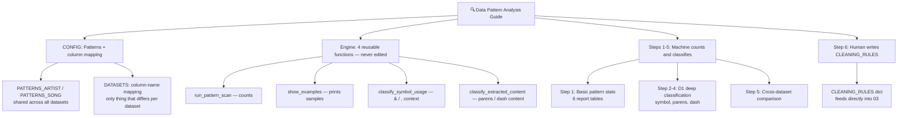

# 🔍 02 Data Pattern Analysis Guide



## Universal Pattern Analysis Template

**Applicable to:** Any text column that mixes real content with formatting noise (names, titles, free-text fields)
**Purpose:** Figure out *what* to clean before writing any cleaning code — count how often a pattern appears, then classify what it actually means, so the cleaning rules in the next stage are based on evidence, not guesswork
**Last Updated:** July 2026

**Datasets used in this project:**

| Dataset | Source |
|---|---|
| D1 Billboard Hot 100 | [Kaggle →](https://www.kaggle.com/datasets/dhruvildave/billboard-the-hot-100-songs) |
| D2 Spotify Hit Predictor | [Kaggle →](https://www.kaggle.com/datasets/theoverman/the-spotify-hit-predictor-dataset) |
| D3 Music Dataset 1950-2019 | [Kaggle →](https://www.kaggle.com/datasets/saurabhshahane/music-dataset-1950-to-2019) |

---

## The Core Design Principle: CONFIG / Engine / Human Judgment

Stage 01 has one health-check station that draws its own conclusions automatically ([OK]/[WARN]). Stage 02 can't work that way — deciding whether `&` in an artist name means "featuring" or is just part of a duo's name isn't something a regex can decide on its own. So this stage splits into four layers instead of two:

- **CONFIG** — pattern lists (`PATTERNS_ARTIST`, `PATTERNS_SONG`) written once and shared across every dataset, plus a column-name mapping (`DATASETS`) for the one thing that actually differs per dataset.
- **Engine** — four generic functions (`run_pattern_scan`, `show_examples`, `classify_symbol_usage`, `classify_extracted_content`). They only know how to count and classify against whatever CONFIG they're handed — they never decide what should be cleaned.
- **Steps 1-5** — the execution layer. Loops over `DATASETS`, feeds each column into the Engine, and prints a report. This is still 100% automatic, but the *output* is a report for a human to read, not a verdict.
- **Step 6 — `CLEANING_RULES`** — the only step that isn't generated by code. After reading every report from Steps 1-5, the rules are hand-written into a structured dict, which stage 03 consumes directly.

```python
PATTERNS_ARTIST = [
    ("Contains 'Featuring'",      r'Featuring'),
    ("Contains 'feat.' or 'ft.'", r'feat\.|ft\.'),
    ("Contains '&'",              r'&'),
    # ... shared across D1/D2/D3, written once
]

DATASETS = {
    "D1": {"df": d1_billboard,   "artist_col": "artist",      "song_col": "song"},
    "D2": {"df": d2_spotify_all, "artist_col": "artist",      "song_col": "track"},
    "D3": {"df": d3_music,       "artist_col": "artist_name", "song_col": "track_name"},
}

for dataset_name, cfg in DATASETS.items():
    stats = run_pattern_scan(cfg["df"], cfg["artist_col"], PATTERNS_ARTIST)
```

Adding a new pattern to check means editing `PATTERNS_ARTIST` in one place — all three datasets pick it up automatically. Adding a new dataset means adding one entry to `DATASETS` — none of the four Engine functions change.

---

## What Gets Checked — 6 Steps

| Step | Checks (function) | Question it answers | Who concludes |
|---|---|---|---|
| 1. Basic Pattern Stats | `run_pattern_scan` | How often does each symbol/pattern appear, and what % of rows? | Machine (pure count, objective) |
| 2. `&` / `,` Classification | `classify_symbol_usage` | Does this symbol sit next to a collab marker (feat./ft./with), or appear more than once? | Machine classifies → **human reads the report and decides** |
| 3. Parenthetical Content | `classify_extracted_content` + `PAREN_CATEGORIES` | Is the bracketed text a version tag (Remix/Live/Remaster), or part of the actual title? | Machine classifies → **human decides** |
| 4. Post-Dash Content | Same function, different `DASH_CATEGORIES` | Does the text after a dash look like a version tag or a subtitle? | Machine classifies → **human decides** |
| 5. Cross-Dataset Comparison | `three_way` table | How differently does the same pattern show up across D1 vs D2 vs D3 — which dataset is "dirtiest"? | Machine computes → **human reads the trend** |
| 6. `CLEANING_RULES` | Hand-authored dict | Given everything above, what should actually be removed vs kept? | **Pure human judgment** — the only step that isn't code output |

> **Scope note (updated):** The original R version only ran the Step 2-4 deep classification on **D1**; D2 and D3 only got the Step 1 counts plus a manually written conclusion, with no classification code behind it. This Python version deliberately goes further — Steps 2-4 run identically across **all three datasets**, not just D1. The classification functions were already generic (they don't hardcode which dataset they're looking at), so there was no real reason to leave D2/D3 running on guesswork once the tooling existed to just check. That decision paid off: it turned up a real gap where D2's artist-column parentheses were being left as a blanket "preserve," when the same evidence-based classification showed 59% of them were collab-related and just as safe to strip as D1's. `CLEANING_RULES` (Step 6) now uses one consistent schema across all three datasets — every dataset gets the same rule keys, with empty lists where a dataset genuinely doesn't need that kind of cleanup, rather than a different shape of config for datasets that need less work.

### Why artist columns and song columns need separate CONFIGs, even with the same function

`classify_extracted_content()` is one generic function, but it's called with two *different* category lists depending on the column:

- **Artist parentheses** ask a narrow question: is this collab-related (`feat`/`duet`/`featuring`) and therefore safe to strip? Anything else is preserved as group metadata.
- **Song parentheses** ask a broader question: is this a Remix/Live/Remaster/Radio Edit version tag, or is it actually part of the title?

Reusing the song categories on the artist column (an early mistake caught during development) silently misclassifies artist names, because the two columns encode fundamentally different kinds of information even though both happen to use parentheses. **The lesson: sharing an Engine function across columns is fine — sharing its CONFIG across columns that answer different questions is not.**

### A real example of why the report has to be read, not trusted blindly

Two independently-written `contains '()'` patterns produced different counts on the same column: an early practice version used `[\(\)]` (any single bracket character) and got 22,908 matches on D1 song titles, while the version that matches the original R logic uses `\(.*\)` (a *complete* opening-to-closing pair) and gets 22,882 — a 26-row gap made up entirely of songs with one stray, unpaired bracket.

**Takeaway:** when two runs of "the same" pattern check disagree, check whether the regex definitions actually match character-for-character before suspecting the data. The data was fine; the two checks were quietly asking slightly different questions.

---

## Decision Flow

```
Read the Step 1 report for a new dataset/column
    ↓
Any pattern appearing at a meaningful rate?
    → No  → leave it out of CLEANING_RULES, move on
    → Yes → does it need deeper classification (Step 2-4 style)?
        → Yes → add a CONFIG category list, call classify_extracted_content()
        → No  → the Step 1 count is enough evidence on its own
    ↓
Read Step 5's cross-dataset comparison
    → Confirms whether the pattern is dataset-specific or universal
    ↓
Write the decision into CLEANING_RULES (Step 6) — by hand, with reasoning
    → Hand this dict directly to 03_data_wrangling's clean_column()
```

---

## ⚠️ Common Mistakes

| Mistake | Cause | Fix |
|---|---|---|
| Reusing one column's CONFIG category list on a different column | Assumed "same function call" meant "same rules apply" | Check whether the two columns are actually answering the same classification question before sharing a CONFIG |
| Treating a machine-generated report as the final decision | Forgetting Steps 1-5 only count/classify, they never conclude | Only Step 6 (`CLEANING_RULES`) is a decision — everything above it is evidence to read |
| Assuming two "matching" regex checks that disagree means the data is wrong | Didn't compare the regex patterns themselves first | Diff the two regex definitions character-by-character before suspecting the dataset |
| Mixing CONFIG constants and Engine function definitions in the same code block | Convenient to write together while prototyping | Keep them in separate, clearly labeled sections — CONFIG is data, Engine is logic, and future edits should only ever touch one or the other |

---

*Part of [Fu Wei's Data Analysis Pipeline](../README.md)*
