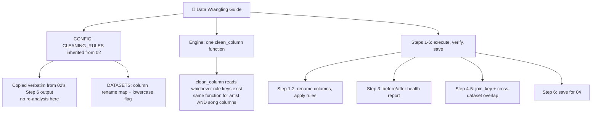

# 🧹 03 Data Wrangling Guide



## Universal Data Wrangling Template

**Applicable to:** Any pipeline stage that needs to execute cleaning decisions someone already made, rather than make new ones
**Purpose:** Turn 02's `CLEANING_RULES` into actually-cleaned data, with a factual before/after check at every step — no new judgment calls happen here
**Last Updated:** July 2026

---

## The Core Design Principle: One Engine Function, Not Six

The R version hand-writes six cleaning functions — one artist cleaner and one song cleaner per dataset (`clean_d1_artist`, `clean_d1_song`, `clean_d2_artist`, ...). Each repeats the same shape of logic (lowercase, trim, strip parenthetical tags, strip after a marker) with small per-dataset variations baked directly into the function body.

This version replaces all six with **one generic `clean_column(series, rules, lowercase=True)`**. It doesn't know or care which dataset it's cleaning — it just reads whichever keys exist in the `rules` dict handed to it and applies them:

```python
CLEANING_RULES = {
    "D1": {
        "artist": {"remove_after_marker": [...], "remove_parens_if_contains": [...]},
        "song":   {"remove_version_tags_in_parens": [...], "remove_brackets_entirely": True},
    },
    # D2, D3 same shape
}

clean_column(df["artist"], CLEANING_RULES["D1"]["artist"], lowercase=True)
```

This only works because the *previous* stage (02) deliberately settled on one consistent rule schema across every dataset and column type. If 02 had left D3 using a different shape of config, 03's engine would have needed dataset-aware branching — which is exactly the kind of logic that's supposed to live in CONFIG, not in code.

---

## What Happens — 6 Steps

| Step | What it does | Why |
|---|---|---|
| 1. Column Name Alignment | Renames D2's `track` → `song`, D3's `artist_name`/`track_name` → `artist`/`song` | 04 needs one consistent column name to join on |
| 2. Apply Cleaning Rules | Runs `clean_column()` against every dataset's artist/song columns using 02's rules | The actual cleanup |
| 3. Health Report | Before/after diff — how many rows changed, with real examples | Catches cleaning that ran too aggressively or not enough, without re-deciding what *should* be cleaned |
| 4. Join Key Creation | `join_key = artist_clean + "\|" + song_clean` | One key to match on instead of two separate columns |
| 5. Cross-Dataset Overlap | How much of D1's join_key set exists in D2 / D3 | Sets expectations before the real merge in 04 |
| 6. Save | `.pkl` per dataset | Hands off to 04 |

### A validation win worth calling out

The R version's closing note states the D1–D3 exact match rate is "approximately 10.6%." Running Step 5 on the Python version independently produced **10.63%** — a near-exact match without ever looking at that number while writing the code. That's a strong signal the full 01 → 02 → 03 chain is faithfully reproducing the original logic, not just superficially similar.

### An inherited inconsistency — investigated, not just flagged

R's `clean_d1_artist()` and `clean_d2_artist()` both lowercase before cleaning; `clean_d3_artist()` only trims — it never lowercases. The first instinct was to treat this as a likely oversight and consider "fixing" it. But a hypothesis about data quality should be checked against the data before acting on it: a direct scan of D3's raw `artist_name`/`track_name` columns showed **0 of 28,372 rows contain any uppercase letter at all** — the source data was already fully lowercase. R's missing lowercase step was never actually a data-quality bug; it was harmless because there was nothing for it to change.

`lowercase: True` is still set for D3 in this version, but as defensive code (free, zero-risk, guards against a future raw CSV that isn't pre-lowercased) rather than as a correction to a real problem. Re-running Step 5's cross-dataset overlap check confirmed this directly: the D1∩D3 match count was bit-for-bit identical before and after the change (3,155 keys, 10.63%) — the numbers didn't move because there was nothing to move. The lesson: when R and Python disagree on some processing detail, check what actually happens to the data before deciding it needs fixing — sometimes the disagreement is real but harmless.

---

## Decision Flow

```
02 hands off CLEANING_RULES (already unified schema)
    ↓
Rename columns so every dataset speaks the same artist/song vocabulary
    ↓
clean_column() applies whatever rule keys are present — no new decisions here
    ↓
Health report: does the before/after diff look sane?
    → No  → the bug is almost certainly in 02's rules, not in 03's engine
    → Yes → build join_key, check overlap, save
```

---

## ⚠️ Common Mistakes

| Mistake | Cause | Fix |
|---|---|---|
| Writing a new cleaning function per dataset | Copying R's structure instead of questioning it | If the previous stage's config is uniform, one Engine function should handle every dataset |
| Silently "fixing" an inherited inconsistency (like D3's missing lowercase step) | Assuming R's behavior was always intentional | Reproduce it faithfully first, flag it explicitly, and let a human decide whether it's actually a bug worth fixing |
| Treating a wrangling-stage surprise as a bug in the wrangling code | Forgetting where the judgment call actually lives | If cleaned output looks wrong, check whether the *rules* (from the previous stage) are wrong before rewriting the engine |
| Re-analyzing patterns from scratch in this stage | Not trusting the previous stage's output | This stage should only ever *execute* a config another stage already produced — if it needs new judgment, that belongs upstream |

---

*Part of [Fu Wei's Data Analysis Pipeline](../README.md)*
