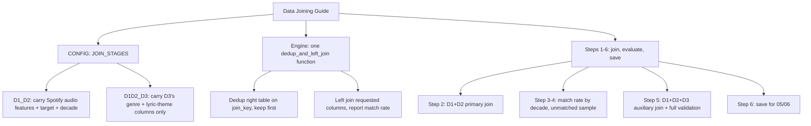

# 04 Data Joining

**See it in action:** [`04_data_Joining_auto.ipynb`](../data-analysis-projects/music-analysis/Python/04_data_Joining_auto.ipynb) · [rendered preview](https://vivian-be-nerd.github.io/FuWei-Portfolio/data-analysis-projects/music-analysis/Python/04_data_Joining_auto.html)

## What This Stage Did

Merged the three cleaned datasets into one table: Billboard chart data as the base, Spotify audio features joined in as the primary source, and genre/lyric-theme data joined in as a secondary source. Every join reports a match rate, not just "it ran without an error."

## How I Did It

One shared join function (`dedup_and_left_join`), called twice with different config, since the two joins need different columns and different match criteria. I deliberately didn't carry over every column the third dataset offers. It happens to have its own columns with the same names as the Spotify audio features (danceability, energy, etc.) from a completely different source, and merging all of them would've silently created two different "energy" columns that look interchangeable but aren't.

Both join stages also deduplicate their right-hand table before joining — keeping whichever row happens to appear first for a given key, not necessarily the "best" one by any rule. The Spotify dataset alone has roughly 1,300 duplicate keys resolved this way. It's a known, existing limitation rather than something this stage tries to correct — worth revisiting only if it turns out to actually distort a downstream result.

## Open Questions / Things I'd Revisit

- The secondary join's match rate (~14%) is far lower than the primary join's (~80%) — expected, since genre/lyric-theme coverage is inherently sparser than audio-feature coverage, but worth remembering as a caveat on any genre-based finding downstream (05, 07).
- The arbitrary tie-break on duplicate join keys (above) hasn't been checked for whether it actually distorts any specific downstream number — it's flagged as a limitation, not yet confirmed harmless or harmful.

---

*Part of [Fu Wei's Data Analysis Pipeline](../README.md)*
