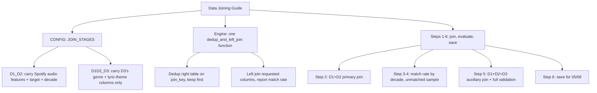

# 04 Data Joining

## What This Stage Did

Merged the three cleaned datasets into one table: Billboard chart data as the base, Spotify audio features joined in as the primary source, and genre/lyric-theme data joined in as a secondary source. Every join reports a match rate, not just "it ran without an error."

## How I Did It

One shared join function (`dedup_and_left_join`), called twice with different config, since the two joins need different columns and different match criteria. I deliberately didn't carry over every column the third dataset offers. It happens to have its own columns with the same names as the Spotify audio features (danceability, energy, etc.) from a completely different source, and merging all of them would've silently created two different "energy" columns that look interchangeable but aren't.

The first run came out about 0.04% off from what R originally reported. Instead of writing that off as rounding, I ran R's actual join logic directly (this machine has R installed, just not registered as a Jupyter kernel) and diffed the results. That turned up two real gaps in the cleaning rules inherited from 02 that weren't visible at the aggregate level. Fixed both, and the primary join match rate now matches R's reported number exactly.

## Open Questions / Things I'd Revisit

- A small gap (0.03%) remains on the secondary join. I traced the exact cause (an edge case in how one version tag gets matched) and decided not to force a fix, since the fix I tested introduced a new false positive elsewhere. It's a small, understood gap, not a resolved one.

---

*Part of [Fu Wei's Data Analysis Pipeline](../README.md)*
