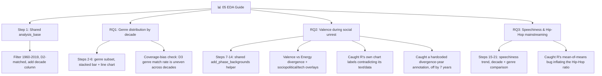

# 📊 05 EDA Guide



## When NOT to Force CONFIG/Engine

**Applicable to:** Any pipeline stage where the work is genuinely different per unit of analysis, not the same transform repeated
**Purpose:** Turn 04's joined dataset into the three research-question narratives the project proposal promised, each with its own charts and interpretation — not a fourth loop over three interchangeable datasets
**Last Updated:** July 2026

---

## The Core Design Principle: Recognizing When the Shape Isn't a Loop At All

Stages 01–04 apply CONFIG/engine separation because the *same logic* runs against multiple datasets (or, in 04's case, two genuinely different but structurally similar joins). Stage 05 is different in kind: three research questions, each requiring its own subset, its own chart types, and its own domain interpretation. Forcing a `RQ_CONFIG = {...}` dict here wouldn't remove complexity — it would just hide three unrelated analyses behind a shared shape they don't actually share.

The discipline that *does* carry over: when the same sub-logic really does repeat — not "structurally similar" but "literally the same code" — pull it into a shared function anyway. RQ2 draws three different charts (feature trends, valence/energy divergence, two historical-context overlays) that all need the same three-era background shading and divider lines. R's `.qmd` pasted that block three times. Python extracts it once:

```python
def add_phase_backgrounds(ax, label_y=0.90, alpha=0.06):
    for start, end, color, label, text_color in PHASES:
        ax.axvspan(start, end, color=color, alpha=alpha, zorder=0)
        ...
```

The lesson from 04 generalizes further than "CONFIG/engine is about where a decision lives, not how many times a loop runs" — it's really about *not letting the absence of a loop excuse real duplication*. A notebook can correctly skip CONFIG/engine at the top level and still owe the reader a shared helper for anything that's copy-pasted three times.

---

## What Happens — 21 Steps Across 3 Research Questions

| Step | What it does | Why |
|---|---|---|
| 1. Setup | Load 04's `D1_D2_D3_joined.pkl`, filter to 1960–2019 + D2-matched rows, derive `decade` | One shared foundation (`analysis_base`) — every RQ starts from the same base, computed once |
| 2–6. RQ1 | Subset to D3-matched (genre-labeled) rows, tabulate genre % by decade, stacked bar + trend line | Does the genre mix of the Hot 100 shift across six decades? |
| 7–14. RQ2 | Build `features_yearly` (5 audio features), shared `add_phase_backgrounds()`, valence trend, valence-vs-energy divergence, sociopolitical + tech-era overlays, decade summary table | Does musical mood track social/technological upheaval? |
| 15–21. RQ3 | Speechiness by year/decade/genre, Hip-Hop vs Other Genres by decade | Does rising speechiness track Hip-Hop's mainstreaming? |

**Scope note:** the project proposal's RQ4 ("which audio features best predict a chart hit") is a modeling question, deliberately deferred to 06 — confirmed against both the R `.qmd` Executive Summary and the original proposal text before starting, not assumed.

---

## Three Validation Wins Worth Calling Out

### 1. R's own chart labels didn't match its own numbers

Re-running R's actual RQ2 logic through `Rscript.exe` (not just reading its rendered `.html`) turned up an internal contradiction inside the R source itself: the *text* narrative said valence declined "~0.670 → ~0.502," but the *hand-typed label* on the chart read "0.49"; the energy chart's hand-typed label read "0.73" against an actual computed value of 0.628. The labels were literal strings typed into the plotting code at some earlier point in the project and never re-synced after the data or computation changed — not a live-computed annotation.

Python's `analysis_base` reproduced R's row count exactly (262,737) and its real computed values to the decimal (valence 0.650→0.503, energy 0.453→0.628). The fix wasn't a code change — it was trusting the freshly-computed number over a stale hardcoded label that merely *looked* authoritative because it was sitting inside the "official" R file.

### 2. R's headline Hip-Hop statistic used the wrong kind of average

R reported "Other Genres average 0.0646, Hip-Hop is 4.8x higher." Re-verifying against a direct `Rscript.exe` run surfaced that this number came from **averaging the six genres' own means** (mean of means), not from a **grand mean weighted by song count**. Reggae (159 songs) and Pop (27,700 songs) each contributed one unweighted data point to that average, pulling the "Other Genres" figure upward even though reggae barely affects the actual population of songs.

The grand mean — every song counted once, computed directly in Step 20 — gives **Other Genres = 0.0603, Hip-Hop = 3.86x**, not 4.8x. Both numbers describe something true, but only one answers "how does a typical Billboard song's speechiness compare to a typical Hip-Hop song's" — the question the RQ actually asks. This wasn't a Python bug to fix; it was a statistical-methodology gap in the R original that only surfaced by re-deriving the number from raw rows instead of trusting a reported summary statistic.

### 3. A hardcoded annotation was seven years off — caught by eye, confirmed by data

The RQ2 divergence chart (Step 11) carries an annotation, "Valence & Energy begin to diverge," pointing at a specific year. Both R's original `.qmd` and this notebook's first draft hardcoded that year as **1993** — and it's the same literal `1993` pasted into three separate charts (the main divergence plot plus both historical-context overlays), which is itself a tell: three independently *derived* numbers don't usually come out identical, but three copies of the same typed guess do.

Looking at the rendered chart directly (not re-running R this time — just reading the plot) surfaced that the crossover visibly happens earlier than where the label sits. Computing the year-by-year gap (`energy - valence`) from `features_yearly` confirmed it precisely:

| Year | Valence | Energy | Leader |
|---|---|---|---|
| 1984 | 0.6618 | 0.6823 | Energy (first, single-year flip) |
| 1985 | 0.6824 | 0.6807 | Valence (barely — a 0.0017 margin) |
| **1986** | 0.6578 | 0.6726 | **Energy (never loses the lead again through 2019)** |

The real crossover is **1986**, seven years earlier than the hardcoded 1993. All three charts' annotation coordinates were recomputed from the actual 1986 values (`xy`/`xytext` now sit on the real data points, not an eyeballed guess) rather than just nudging the old x-value. This is the same category of issue as the stale "Energy 0.73" label above — a hand-placed visual marker that was never re-validated against the numbers it's supposed to represent — except this time it was human pattern-matching against the chart itself, not a full R re-run, that caught it.

---

## Decision Flow

```
04 hands off D1_D2_D3_joined.pkl
    ↓
Is this stage "same logic, multiple datasets/joins"?
    → Yes → CONFIG/engine (01-04's pattern)
    → No, it's genuinely different analyses per unit → don't force a shared config
    ↓
Within a no-CONFIG notebook, does a code block repeat 2+ times verbatim?
    → Yes → extract a shared function anyway (add_phase_backgrounds)
    → No → leave it inline, one-off code doesn't need a home
    ↓
Every number that traces back to an R-reported figure →
    re-derive it directly (Rscript.exe or raw-row computation), don't trust the rendered label/summary
    → Matches → confidence confirmed
    → Doesn't match → is it a stale label, or a real methodology gap? Diagnose before "fixing"
```

---

## ⚠️ Common Mistakes

| Mistake | Cause | Fix |
|---|---|---|
| Forcing CONFIG/engine onto a stage that isn't actually a loop | Treating "01-04 all used this pattern" as a rule instead of a fit for a specific shape | Recognize when the work is genuinely per-question/per-analysis, not the same transform repeated, and skip the abstraction |
| Leaving real duplication inline because "this notebook doesn't use CONFIG/engine" | Conflating "skip the top-level pattern" with "skip all reuse" | Extract a shared function the moment the *same* code (not just similar-shaped code) appears 2+ times |
| Trusting a chart's hand-typed label as ground truth because it's in the "authoritative" source file | Assuming anything inside the original R `.qmd` was computed live | Re-derive the number directly; a label is just a string someone typed once and may never have been updated |
| Accepting a reported summary statistic (e.g., "4.8x") without checking how it was averaged | Mean-of-means and grand-mean look identical in a sentence but answer different questions | When genre/category group sizes are very unequal, always check whether a cross-group comparison is weighted by n or not |
| Assuming a coverage subset (e.g., D3-matched genre rows) is evenly distributed across the axis being compared | Not checking match-rate uniformity before comparing % breakdowns across decades | Check per-decade coverage % explicitly (RQ1: 14–19%, uneven) and report it as a stated limitation, not a silent assumption |
| Placing an annotation coordinate (e.g., "trend begins here") at an eyeballed or copy-pasted x-value | The same literal coordinate appearing in multiple charts is itself a tell — it's one typed guess reused, not several independent calculations agreeing | Compute the actual crossover/inflection point from the data (a simple year-by-year diff is enough) and anchor the annotation to that value |

---

*Part of [Fu Wei's Data Analysis Pipeline](../README.md)*
