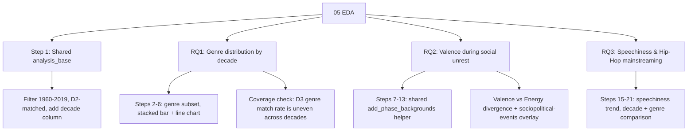

# 05 EDA

## What This Stage Did

Took 04's joined dataset and answered three of the four research questions from the project proposal:

- **RQ1** — Has the genre mix on the Hot 100 shifted over six decades?
- **RQ2** — Does mood (valence) track periods of social/tech upheaval?
- **RQ3** — Does rising speechiness track Hip-Hop going mainstream?

RQ4 (which audio features predict a hit) is a modeling question. That's 06, not this stage.

## What I Found

- **Genre mix (RQ1)**: Pop went from 61% of the Hot 100 in the 1960s to 78% in the 2010s. Rock peaked at 34% in the 1980s and fell to 4% by the 2010s. Blues and jazz nearly disappeared, from 15% and 6% in the 1960s to under 1% now.
- **Mood vs. energy (RQ2)**: Valence (musical positivity) fell from 0.65 in 1960 to 0.50 in 2019, about a 23% drop. Energy moved the opposite way, from 0.45 to 0.63 over the same period. The two tracked each other reasonably well through the 1970s, then started pulling apart in the mid-1980s and never came back together.
- **Speechiness and Hip-Hop (RQ3)**: Speechiness roughly doubled, from 0.049 in the 1960s to 0.099 in the 2010s. Hip-Hop tracks average 3.9x the speechiness of every other genre combined, the clearest sign in the audio data itself that Hip-Hop went mainstream.

## How I Did It

Each research question gets its own subset of the data and its own charts. I didn't force the same CONFIG/engine pattern I used in 01–04, because each question needs different logic, not the same transform repeated three times. The one place I did pull out shared code: three of the RQ2 charts needed the same background shading, so that became one function instead of three separate copies.

I also didn't trust a first-pass calculation at face value — recomputed everything and double-checked it. That caught a few real issues: a chart label that had been typed by hand and never updated to match the data behind it, and a genre average that was calculated the wrong way (unweighted instead of weighted by song count).

## Open Questions / Things I'd Revisit

- RQ1 and RQ3's genre comparisons only cover 14–19% of the dataset: not every song has a genre label, and the coverage isn't even across decades. The trends probably still hold directionally, but I wouldn't treat the exact percentages as precise.
- Hip-Hop's speechiness numbers likely undercount its influence, since Pop songs with rap elements probably aren't tagged as Hip-Hop in this dataset.
- The "divergence" annotation on the RQ2 chart is a judgment call about what point best represents the story, not a fully principled calculation. Someone else might reasonably place it differently.

---

*Part of [Fu Wei's Data Analysis Pipeline](../README.md)*
