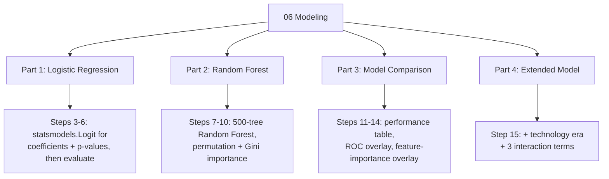

# 06 Modeling

**See it in action:** [`06_modeling_auto.ipynb`](../data-analysis-projects/music-analysis/Python/06_modeling_auto.ipynb) · [rendered preview](https://vivian-be-nerd.github.io/FuWei-Portfolio/data-analysis-projects/music-analysis/Python/06_modeling_auto.html)

## What This Stage Did

Took the Spotify Hit Predictor dataset (already balanced 50/50 Hit/Flop) and asked which audio features best explain whether a song became a hit — answered with two classifiers run through the same evaluation pipeline: Logistic Regression (explanatory — coefficients and statistical significance) and Random Forest (predictive strength, non-linear relationships).

## What I Found

- Random Forest outperformed Logistic Regression on every metric (Accuracy 0.784 vs. 0.729, AUC 0.867 vs. 0.807) — real evidence that the relationship between audio features and chart success has non-linear structure LR's linear formula can't fully capture.
- Instrumentalness, acousticness, and danceability were the strongest, most consistent signals across both models.
- Adding technology-era dummies plus 3 feature-interaction terms (danceability × energy, instrumentalness × acousticness, danceability × valence) lifted the Logistic Regression model's Pseudo R² from 0.232 to 0.254. `danceability × energy` (+9.28) turned out to be the single strongest driver in the extended model — stronger than any individual feature on its own.

## How I Did It

One dataset, two models, evaluated through the same shared pipeline (`build_modeling_dataset()`, `evaluate_classifier()`) — that repeated evaluation logic (confusion matrix, accuracy, sensitivity/specificity, AUC, ROC) is called once each for LR and RF instead of being written twice.

Logistic Regression uses `statsmodels.Logit` rather than scikit-learn's classifier, specifically because it exposes standard errors, z-values, and p-values — the statistical-significance output scikit-learn's own `LogisticRegression` doesn't return. Random Forest's feature importance is measured two ways (permutation importance on the held-out test set, plus scikit-learn's built-in Gini-based importance), since the two can tell different stories about which features matter.

## Open Questions / Things I'd Revisit

- This is explanatory, not predictive — the model exists to explain historical associations, not to forecast future hits. A Pseudo R² around 0.23-0.25 means a large share of what separates a Hit from a Flop still isn't captured by audio features alone.
- Six decades are pooled into one model. Feature-hit relationships may not be stable across eras; a decade-specific model is a natural next step, not something this stage attempts.
- LR's coefficient magnitude and RF's permutation importance aren't on the same scale and can disagree on a given feature. Divergence is itself a signal worth reading (redundancy with a correlated feature, or a non-linear/interaction effect) — not a contradiction to explain away.

---

*Part of [Fu Wei's Data Analysis Pipeline](../README.md)*
