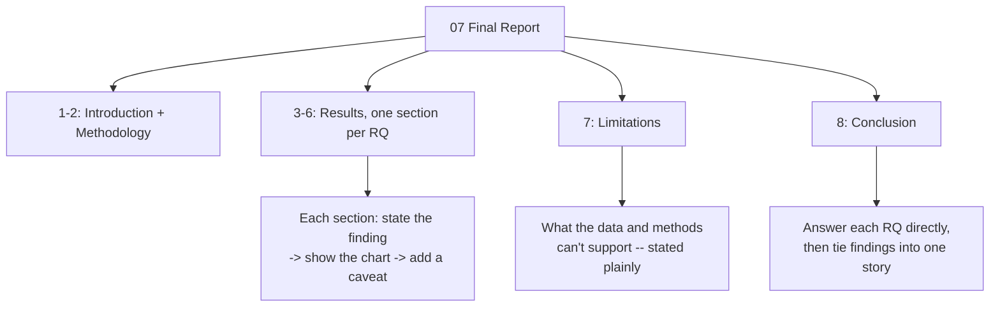

# Build Notes: 07 Final Report

**See it in action:** [`07_Final_Report_auto.ipynb`](../data-analysis-projects/music-analysis/Python/07_Final_Report_auto.ipynb) · [rendered preview](https://vivian-be-nerd.github.io/FuWei-Portfolio/data-analysis-projects/music-analysis/Python/07_Final_Report_auto.html)

## What This Stage Did

Assembled the findings from 05 (EDA) and 06 (modeling) into one report, answering the project's four research questions for a non-technical reader: how genre distribution shifted, how emotional tone evolved, whether speechiness reflects Hip-Hop going mainstream, and which audio features predict a hit.

## What I Found

The four research questions turned out not to be independent — they're four views of the same six-decade transition. The rhythmic, speech-heavy aesthetic RQ3 traces to Hip-Hop's mainstreaming helps explain part of RQ2's valence decline; the structural features that dominate RQ4's models (danceability, low instrumentalness) reflect the same genre shift RQ1 documents at the chart level.

Not every original hypothesis survived, though: RQ2's premise — that social unrest tracks with declining mood — doesn't hold up against a direct timeline check (the clearest valence crash starts in 1980, a year before the AIDS crisis it might otherwise seem to explain). Reporting that a hypothesis didn't hold up is still a finding, not a failed section.

## How I Did It

No CONFIG/Engine here — this is a one-time narrative synthesis, not a script meant to run on new data. What's reusable isn't the code, it's the report *structure*: state a finding, show the supporting chart(s), add a caveat — repeated once per research question — then a Limitations section (stated plainly, not hedged around) and a Conclusion that answers each question directly before tying them together.

Every chart is a pre-rendered image from 05's or 06's own output, loaded through two small helper functions (`show()`, `show_row()`) rather than reprocessed here — this notebook does no data work of its own.

## Open Questions / Things I'd Revisit

- Every claim here is only as strong as the notebook that produced it. The genre-based findings (RQ1, part of RQ3) inherit 05's 14-19% genre-coverage limitation; RQ4's Pseudo R² of ~0.25 means most of what makes a hit a hit still isn't captured by audio features alone.
- D3's genre field turned out to be a documented dead end, not just an assumed one: its source paper's own citation is now a broken link, and Spotify's current API docs don't disclose how a multi-genre artist gets reduced to one label per track.
- A search for external data (marketing spend, artist popularity, social reach) to help explain the majority of hit-status the model can't account for didn't turn up anything with historical coverage back to 1960 — a real data-availability limit, not an unexplored research direction.

---

*Part of [Fu Wei's Data Analysis Pipeline](../README.md)*
