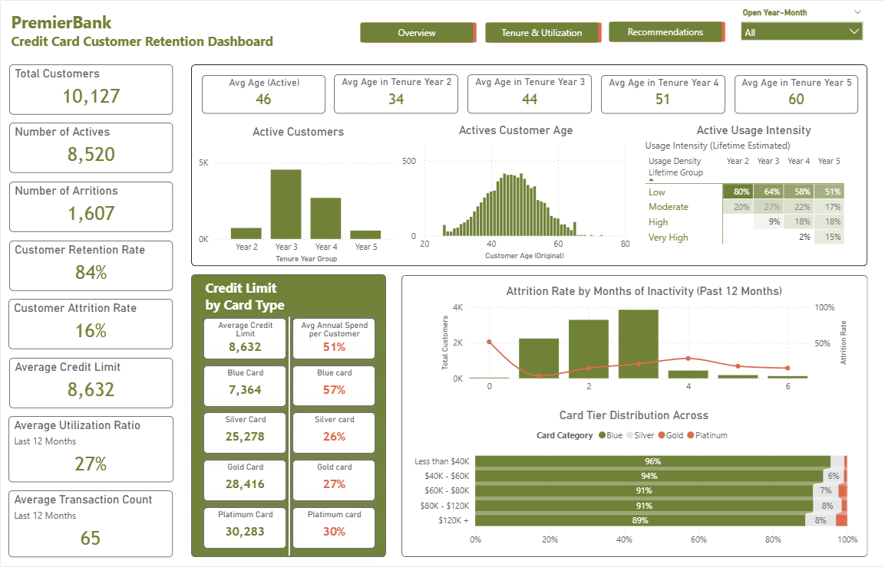
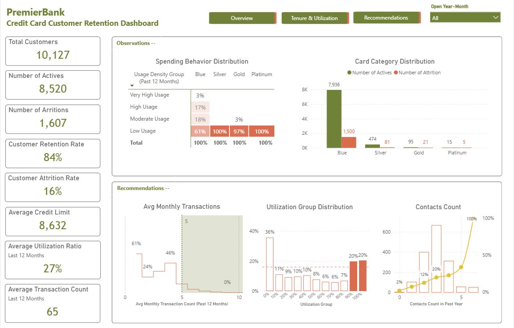

# Project 4: Banking Customer Retention Analysis

## Project Overview

Analyzed credit card customer retention patterns for a hypothetical bank to identify churn drivers and develop targeted engagement strategies. Examined 10,127 customers across different card tiers, usage behaviors, and demographic segments. Discovered U-shaped churn pattern with both low-usage (61% churn for <5 monthly transactions) and high-usage segments exhibiting 20%+ attrition rates. Uncovered critical insight: premium cardholders (Gold, Platinum) showed higher churn than basic Blue card users, revealing disconnect between card tier and customer engagement. Identified that 56% of churned low-utilization customers had contacted bank 2-4 times without resolution, indicating systemic support failure.

*Academic case study using simulated data for educational purposes.*

---

## Technologies Used

- **Power BI Desktop** - Multi-page interactive retention dashboard
- **Power Query (M language)** - Customer segmentation, utilization calculations, tenure analysis
- **DAX** - Retention rate metrics, churn indicators, transaction groupings, contact frequency tracking
- **Behavioral Segmentation** - Usage density groups (low, moderate, high, very high)
- **Customer Lifecycle Analysis** - Tenure-based cohort analysis across 5-year periods

---

## Key Achievements

- Identified U-shaped churn pattern affecting both extremes: low-usage customers (<5 monthly transactions) showed 61% churn risk, while very high-usage segment (90%+ utilization) exhibited 20%+ churn, requiring dual-pronged retention strategy

- Discovered premium card paradox: Gold and Platinum cardholders demonstrated higher attrition rates than basic Blue card users despite higher credit limits ($28K-$30K vs $7K), revealing misalignment between card tier positioning and actual customer value perception

- Uncovered support system failure: 56% of churned low-utilization customers contacted bank 2-4 times in past year without resolution, with contact frequency spike (100% churn rate at 5+ contacts) indicating escalating frustration and systematic issue tracking gaps

- Developed risk-based segmentation framework identifying three critical intervention points: onboarding phase (0-5 transactions/year threshold), high-stress monitoring (80%+ utilization), and support escalation pathways for 2+ contact customers to prevent churn before it occurs

---

## Dashboard Screenshots

### Main Dashboard (Complete View)

### Overview Analysis

### Tenure & Utilization Patterns

### Recommendations & Action Items

---

## Project Insights

### Customer Base Overview
- **Total Customers:** 10,127
- **Active Customers:** 8,520 (84% retention rate)
- **Attrited Customers:** 1,607 (16% churn rate)
- **Average Credit Limit:** $8,632
- **Average Utilization Ratio:** 27% (last 12 months)
- **Average Transaction Count:** 65 transactions (last 12 months)

### Card Tier Distribution & Paradox

**Card Category Distribution:**
- Blue Card: 93% of all customers (7,936 active + 1,500 attrited)
- Silver Card: 6% (474 active + 91 attrited)
- Gold Card: ~1% (95 active + 21 attrited)
- Platinum Card: <0.2% (15 active + 5 attrited)

**Average Credit Limits by Tier:**
- Blue Card: $7,364 (57% utilization)
- Silver Card: $25,278 (26% utilization)
- Gold Card: $28,416 (27% utilization)
- Platinum Card: $30,283 (30% utilization)

**Critical Finding - Premium Card Churn:**
- Despite higher credit limits, premium tier customers show elevated churn
- Gold/Platinum holders use only 26-30% of available credit vs 57% for Blue cardholders
- Suggests mismatch between card benefits and actual customer needs

### U-Shaped Churn Pattern

**Monthly Transaction Distribution:**
- 0 transactions: 0% of active, 2% churn (extreme inactivity)
- 1-4 transactions: 24% with 61% churn risk
- 5-9 transactions: 46% with 10-15% churn (healthy engagement)
- 10+ transactions: 24% with 0-5% churn (highly engaged)

**Utilization Group Churn Rates:**
- Very High Usage (90%+ utilization): 20-36% churn across card tiers
- High Usage (70-89%): 9-17% churn
- Moderate Usage (30-69%): 6-11% churn (optimal range)
- Low Usage (<30%): 61-100% churn for Blue cards

**Both Extremes at Risk:**
- Low engagement → perceived lack of value → churn
- High utilization → financial stress, overextension → churn

### Contact Frequency & Support Failure

**Contacts in Past Year vs Churn:**
- 0 contacts: 2% churn (satisfied, self-sufficient)
- 1 contact: ~10% churn (issue resolved)
- 2 contacts: 20% churn (unresolved escalation)
- 3 contacts: 34% churn (frustration building)
- 4 contacts: 50% churn (critical frustration)
- 5+ contacts: 100% churn (support failure, customer lost)

**Critical Insight:**
- 56% of churned low-utilization customers made 2-4 contact attempts
- Issues not resolved effectively → compounded dissatisfaction
- Each additional contact without resolution exponentially increases churn risk

### Demographics & Churn Patterns

**Gender:**
- Active: 60% male, 40% female (balanced)
- Attrited: Similar distribution (no significant gender bias)

**Age Groups:**
- 35-44 years: Largest segment (3,361 customers)
- 45-54 years: Second largest (2,646 customers)
- 65+ years: Smallest segment (99 customers)
- Churn relatively distributed across age groups

**Income Distribution:**
- $40K-$60K: Peak segment (1,956 active)
- <$40K: 605 active customers
- $120K+: 602 active customers (high-value segment)
- Most attrition occurs in $40K-$80K income range

**Marital Status:**
- Single: 83% active, 17% attrited
- Married: 85% active, 15% attrited (slightly better retention)
- Divorced: 84% active, 16% attrited

**Education Level:**
- All education levels show 83-85% retention
- Graduate/Doctorate: 84% retention, 16% churn
- No significant correlation between education and retention

### Tenure & Lifecycle Analysis

**Active Customer Tenure Distribution:**
- Year 2: 0K customers (recent onboarding)
- Year 3: 5K customers (peak retention period)
- Year 4: 3K customers
- Year 5: 1K customers (mature customers)

**Average Age by Tenure:**
- Year 2: 34 years old (younger cohort)
- Year 3: 44 years old
- Year 4: 51 years old
- Year 5: 60 years old (longest-tenured customers aging with bank)

**Attrition by Inactivity (Past 12 Months):**
- 0 months inactive: Low churn baseline
- 1 month: Churn begins
- 2-3 months: Peak churn period (3.5K-4K customers at risk)
- 4+ months: Sustained high churn (~1K per month)

---

## Methodology

### Data Coverage
- **Customer Base:** 10,127 credit card customers
- **Card Tiers:** Blue, Silver, Gold, Platinum
- **Analysis Period:** Past 12 months of transaction and contact data
- **Metrics Tracked:** Utilization ratio, transaction count, contact frequency, tenure

### Data Preparation
1. **Customer segmentation** by card category, income, demographics
2. **Behavioral groupings:**
   - Usage density (low, moderate, high, very high)
   - Transaction frequency buckets
   - Contact count categories
3. **Churn indicators:** Inactivity months, utilization extremes, contact patterns
4. **Tenure analysis:** Cohort grouping by years with bank

### Analysis Structure
- **Overview:** Customer demographics, behavior patterns, card tier distribution
- **Tenure & Utilization:** Lifecycle analysis, usage intensity, churn by inactivity
- **Recommendations:** Risk-based interventions, engagement thresholds, support improvements

---

## Challenges & Solutions

**Challenge:** Understanding why premium cardholders churned at higher rates  
**Solution:** Cross-referenced credit limit, utilization ratio, and transaction patterns—discovered value misalignment (high limits but low utilization suggesting unused benefits)

**Challenge:** Identifying optimal transaction threshold to prevent churn  
**Solution:** Analyzed churn rates across transaction frequency buckets, found clear inflection point at 5 monthly transactions where churn drops dramatically

**Challenge:** Quantifying support system failure impact  
**Solution:** Mapped contact frequency to churn rates, revealing exponential increase after 2+ contacts without resolution

---

## Key Recommendations

### 1. Implement 5-Transaction Minimum Engagement Threshold
**Current State:** 61% churn for customers with <5 monthly transactions  
**Recommendation:**
- Automated engagement campaigns targeting <3 transaction customers
- Welcome nudges for new cardholders (first 90 days)
- Personalized spending category suggestions based on demographics  
**Expected Impact:** Reduce low-usage churn from 61% to 30-35%

### 2. Proactive High-Utilization Monitoring
**Current State:** 20-36% churn for very high-usage (90%+ utilization) customers  
**Recommendation:**
- Real-time alerts for customers exceeding 80% utilization
- Proactive outreach offering credit limit increases or balance transfer options
- Financial wellness resources to prevent overextension stress  
**Expected Impact:** Reduce high-utilization churn from 20%+ to 10-12%

### 3. Restructure Support Escalation Pathways
**Current State:** 56% of churned customers contacted 2-4 times without resolution  
**Recommendation:**
- Automatic escalation to specialist after 2nd contact on same issue
- 48-hour resolution SLA for repeat contacts
- Post-resolution follow-up to confirm satisfaction
- Root cause analysis for issues requiring 3+ contacts  
**Expected Impact:** Reduce contact-driven churn from 50%+ to 15-20%

### 4. Premium Card Value Realignment
**Current State:** Gold/Platinum holders show higher churn despite higher limits  
**Recommendation:**
- Benefit audits for underutilized premium cards
- Personalized benefit activation campaigns (travel rewards, lounge access, concierge)
- Consider downgrading inactive premium holders to Silver with retention bonuses
- Target premium cards to high-transaction, high-income customers only  
**Expected Impact:** Improve premium tier retention by 5-8 percentage points

### 5. Loyalty Rewards for Sustained Engagement
**Current Problem:** No incentive structure for consistent moderate usage  
**Recommendation:**
- Milestone rewards at 5, 10, 20 monthly transactions
- Tenure-based benefits (Year 3+ customers get enhanced rewards)
- Gamification elements for transaction streaks  
**Expected Impact:** Increase moderate-usage cohort retention to 90%+

---

## Business Impact

**Current State:**
- 84% retention rate (16% churn)
- 10,127 customers with $8.6K average credit limit
- $87.4M total credit extended
- 27% average utilization ($23.6M active credit usage)

**Projected Impact of Recommendations:**

**Revenue Protection:**
- **Prevent 400-500 churns annually** (25-30% churn reduction)
- **Retain $3.4M-$4.3M in credit balances** from at-risk customers
- **Reduce acquisition costs:** $200-$400 per customer replacement = $80K-$200K savings

**Customer Lifetime Value (CLV) Enhancement:**
- **Low-usage activation:** Move 1,000 customers from <5 to 5+ transactions
- **Expected revenue increase:** $150-$200 per activated customer = $150K-$200K annually
- **Support efficiency:** 30% reduction in repeat contacts = 500 fewer escalations

**Risk Mitigation:**
- **Prevent high-utilization defaults** through proactive monitoring
- **Reduce credit loss exposure** from financially stressed customers
- **Improve Net Promoter Score (NPS)** through resolved support issues

---

[← Back to Power BI Projects](../PowerBI_README.md) | [← Back to Main Portfolio](../../README.md)

